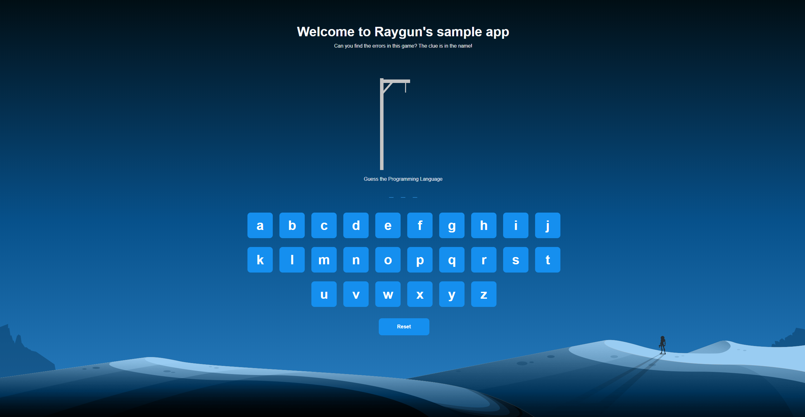

 # ReactJS Hangman Game for Raygun
 
Let's look at some bugs! :bug:

 ### Dependencies

  - Node: [http://nodejs.org/](http://nodejs.org/)
  - ReactJS: [https://reactjs.org](https://reactjs.org)
  - Bootstrap: [https://getbootstrap.com](https://getbootstrap.com)
  
  #### Resulting image looks something like this:

### Initial Set Up

1. Clone the repository
2. `npm install`
3. `npm start` app start with your port number

### How to Find Bugs :mag_right:
 - Click any letter in the word '**RAYGUN**' to fire off some bugs to Raygun Crash Reporting. 
